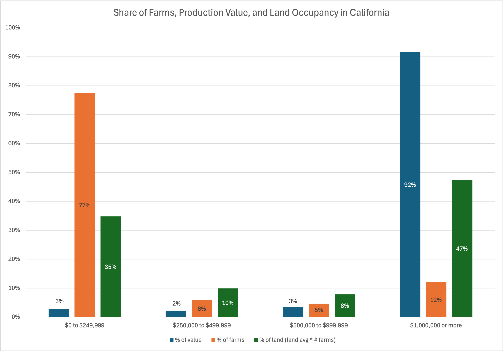

According to the Feb 2024 United States Department of Agriculture(USDA) 2024 report, there are 1.9 million farms in the US, with a total of 879 million acres and an average farm size of 464 acres in 2023. 85.6% of farms operate in the economic sales class of $1,000 to $249,999 occupying 37.4% of the land.[^1] This data source unfortunately did not provide the total sales from those small farms[^2] 

Looking at California specifically, we see a similar trend where 77% of the farms occupy 35% of the 24 million acres of farmland in the state. According to the 2022 Census of Agriculture California State Level data[^3], we see that there of these 77% of the farms, only 2% of the total market value is generated. Alternatively, the 12% of farms that occupy 47% of the land generate up to 92% of the total market value.

Small farmers run some of the following challenges:
- Lack of capital access
- Lack of economies of scale for operations (insurance, purchasing, sales, etc.)
- Vulnerable towards industrial-grade regulations
- Lack of reliable access to water
- Land ownership and availability
- Labor shortages
- Fewer resources to adapt to climate change impacts

While these challenges pose a grim outlook, there is a shift coming from end consumers demanding more seasonal and local foods. Could there be opportunities connecting these small farmers with additional channels directly to the institutions that have made public facing commitments to become a more local and seasonal buyer of food?
  

[^1]: [Farms and Land in Farms 2023 Summary](https://downloads.usda.library.cornell.edu/usda-esmis/files/5712m6524/b2775h03z/ns065w04d/fnlo0224.pdf)
[^2]: Small farms are defined here as farms that generate less than $250,000 per year. This is still a very fluid term given it could be defined by the size of the land, the revenue generated, labor and family involvement, relationship with the local community just to name a few. 
[^3]: [2022 Census of Agriculture - State Data](https://www.nass.usda.gov/Publications/AgCensus/2022/Full_Report/Volume_1,_Chapter_1_State_Level/California/)